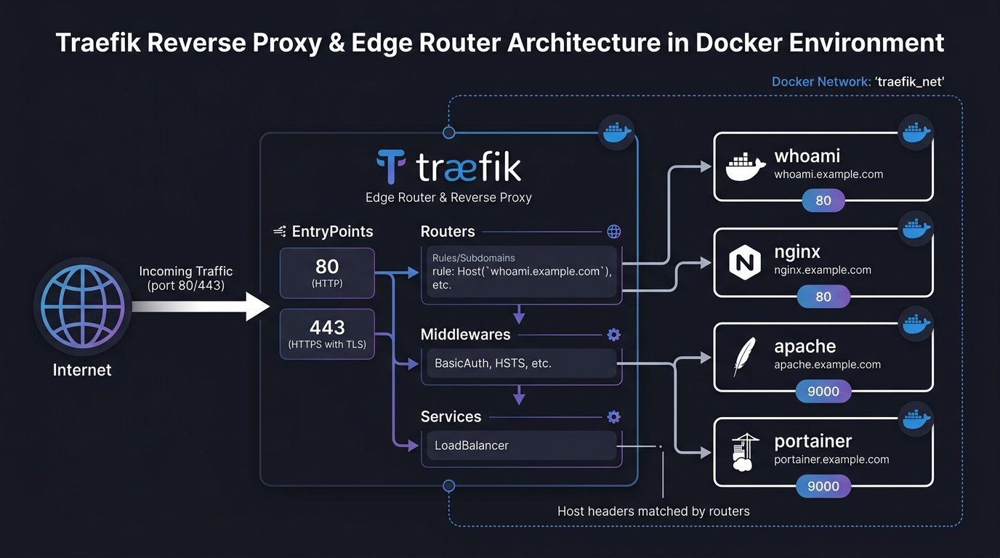

# 🚀 Traefik — Zero to Hero Guide

> **A complete, offline-first, example-driven learning curriculum to master Traefik v2 & v3**  

---

## 📋 Course Curriculum & Chapter Index

Each chapter below contains dedicated offline documentation, architectural diagrams, and ready-to-run example stacks:

| # | Chapter | Topic & Highlights | Chapter Guide & Offline Examples |
|---|---------|-------------------|----------------------------------|
| **00** | 💡 **What is Traefik?** | Architecture, 4 core building blocks, Static vs Dynamic config, Traefik vs Nginx | [📖 Read Chapter 00](./examples/00-what-is-traefik/README.md) |
| **01** | 🐳 **Routing to Docker Containers** | Service discovery, custom bridge network, Docker container labels | [📖 Read Chapter 01](./examples/01-docker-routing/README.md) |
| **02** | 🖥️ **Routing to Local IP Addresses** | Dynamic file provider, loadBalancer, LAN servers & VMs (`10.0.19.5:80`) | [📖 Read Chapter 02](./examples/02-local-ip-routing/README.md) |
| **03** | 🔑 **Middlewares (BasicAuth)** | Password hashing, authentication middleware, middleware chaining | [📖 Read Chapter 03](./examples/03-middlewares-basicauth/README.md) |
| **04** | 🔒 **Let's Encrypt — HTTP Challenge** | Automated SSL via ACME HTTP-01 on port 80, switching to `websecure` | [📖 Read Chapter 04](./examples/04-letsencrypt-http-challenge/README.md) |
| **05** | 🌐 **Let's Encrypt — DNS Challenge** | Wildcard SSL (`*.domain.com`) via Cloudflare API without exposing port 80 | [📖 Read Chapter 05](./examples/05-letsencrypt-dns-challenge-cloudflare/README.md) |
| **06** | 🔀 **Redirect HTTP to HTTPS** | Global port 80 to 443 redirection with `redirectscheme` middleware | [📖 Read Chapter 06](./examples/06-http-to-https-redirect/README.md) |
| **07** | 📊 **Production-Ready Stack & Dashboard** | Securing internal dashboard with BasicAuth + HTTPS, unified apps stack | [📖 Read Chapter 07](./examples/07-production-ready-stack/README.md) |
| **08** | ⚙️ **Advanced Configuration** | TLS 1.2/1.3 ciphers, HSTS/XSS security headers, rate limiting, health checks | [📖 Read Chapter 08](./examples/08-advanced-configuration/README.md) |
| **09** | 🩺 **Troubleshooting & Diagnostics** | Debug logging, error filtering, `acme.json` inspector, route testing tools | [📖 Read Chapter 09](./examples/09-troubleshooting-and-diagnostics/README.md) |
| **10** | ⚡ **Quick Reference & Master Cheat Sheet** | Label cheat sheet, rule syntax, production templates, middleware library | [📖 Read Chapter 10](./examples/10-quick-reference-and-cheat-sheet/README.md) |
| **11** | 🔌 **TCP & UDP Routing (Non-HTTP)** | Routing databases (Postgres/Redis), game servers, SNI & TLS passthrough | [📖 Read Chapter 11](./examples/11-tcp-udp-routing/README.md) |
| **12** | 📈 **Observability: Metrics, Tracing & Logs** | Native Prometheus metrics, OpenTelemetry/Jaeger tracing, JSON access logs | [📖 Read Chapter 12](./examples/12-observability-metrics-tracing/README.md) |
| **13** | 🔐 **SSO & ForwardAuth (Authelia)** | Centralized 2FA/MFA Single Sign-On portal protecting all subdomains | [📖 Read Chapter 13](./examples/13-sso-forwardauth-authelia/README.md) |
| **14** | 🛡️ **Custom SSL & Mutual TLS (mTLS)** | Commercial/Self-signed custom certificates, client certificate authentication | [📖 Read Chapter 14](./examples/14-custom-ssl-and-mtls/README.md) |
| **15** | 🛑 **Plugins & Security (CrowdSec)** | Traefik plugin ecosystem, CrowdSec WAF bouncer & real-time IP banning | [📖 Read Chapter 15](./examples/15-plugins-and-crowdsec/README.md) |
| **16** | ⚡ **HTTP/3 (QUIC) & Brotli** | Traefik v3 native HTTP/3 QUIC over UDP and advanced Brotli compression | [📖 Read Chapter 16](./examples/16-http3-quic-and-brotli/README.md) |
| **17** | ⚖️ **Canary & Traffic Mirroring** | Weighted Round Robin (Canary Deployments) and Traffic Shadowing | [📖 Read Chapter 17](./examples/17-canary-and-mirroring/README.md) |
| **18** | 🦖 **Tailscale Zero-Trust Integration** | Traefik v3 Tailscale certificates for secure, private VPN mesh routing | [📖 Read Chapter 18](./examples/18-tailscale-integration/README.md) |
| **19** | ☸️ **Kubernetes (K3s) & CRDs** | Translating Docker labels to Kubernetes `IngressRoute` and `Middleware` | [📖 Read Chapter 19](./examples/19-kubernetes-ingressroute/README.md) |

---

## ⚡ Prerequisites

Before starting, ensure you have:

- 🐳 **Docker & Docker Compose** installed and operational
- 🌍 A registered **domain name** (e.g. `example.com`)
- ☁️ **Cloudflare** (or your DNS provider) managing your domain records
- 🔓 **Ports 80 & 443** (TCP & UDP) forwarded/open in your firewall / router

---

## 📁 Offline Example Files Directory

All complete configuration stacks and tools are organized offline in [`docs/examples/`](./examples/):

- [`00-what-is-traefik/`](./examples/00-what-is-traefik/) — Core concepts, pipeline architecture & overview
- [`01-docker-routing/`](./examples/01-docker-routing/) — Basic Docker container routing & discovery
- [`02-local-ip-routing/`](./examples/02-local-ip-routing/) — Dynamic file provider for non-Docker / LAN hosts
- [`03-middlewares-basicauth/`](./examples/03-middlewares-basicauth/) — BasicAuth middleware with htpasswd credentials
- [`04-letsencrypt-http-challenge/`](./examples/04-letsencrypt-http-challenge/) — ACME HTTP-01 automated SSL certificates
- [`05-letsencrypt-dns-challenge-cloudflare/`](./examples/05-letsencrypt-dns-challenge-cloudflare/) — ACME DNS-01 Wildcard SSL (*.domain.com)
- [`06-http-to-https-redirect/`](./examples/06-http-to-https-redirect/) — Global HTTP to HTTPS redirection
- [`07-production-ready-stack/`](./examples/07-production-ready-stack/) — Full production stack (Dashboard auth + Wildcard)
- [`08-advanced-configuration/`](./examples/08-advanced-configuration/) — Advanced TLS options, headers, rate limits, health checks
- [`09-troubleshooting-and-diagnostics/`](./examples/09-troubleshooting-and-diagnostics/) — Diagnostic configs, ACME inspector & test scripts
- [`10-quick-reference-and-cheat-sheet/`](./examples/10-quick-reference-and-cheat-sheet/) — Master label cheat sheet & boilerplate templates
- [`11-tcp-udp-routing/`](./examples/11-tcp-udp-routing/) — TCP/UDP non-HTTP routing (PostgreSQL, Redis, SNI)
- [`12-observability-metrics-tracing/`](./examples/12-observability-metrics-tracing/) — Prometheus metrics, Jaeger tracing, access logs
- [`13-sso-forwardauth-authelia/`](./examples/13-sso-forwardauth-authelia/) — Authelia 2FA/SSO ForwardAuth integration
- [`14-custom-ssl-and-mtls/`](./examples/14-custom-ssl-and-mtls/) — Custom commercial certs & Mutual TLS client auth
- [`15-plugins-and-crowdsec/`](./examples/15-plugins-and-crowdsec/) — Traefik plugins & CrowdSec intrusion prevention
- [`16-http3-quic-and-brotli/`](./examples/16-http3-quic-and-brotli/) — Traefik v3 HTTP/3 and Brotli compression
- [`17-canary-and-mirroring/`](./examples/17-canary-and-mirroring/) — Weighted load balancing and traffic shadowing
- [`18-tailscale-integration/`](./examples/18-tailscale-integration/) — Native Tailscale SSL and zero-trust VPN mesh routing
- [`19-kubernetes-ingressroute/`](./examples/19-kubernetes-ingressroute/) — Kubernetes CRD deployments (IngressRoute, Middleware)

---

## 🖼️ Architectural Diagrams Reference

All high-resolution technical diagrams are available offline in [`docs/images/`](./images/):

- `traefik_architecture_overview.jpg` — System architecture overview
- `traefik_core_concepts.jpg` — 4 core building blocks (EntryPoints, Routers, Middlewares, Services)
- `traefik_routing_flow.jpg` — Step-by-step request lifecycle
- `traefik_middleware_basicauth.jpg` — Middleware execution flow and authentication gate
- `traefik_lets_encrypt_http.jpg` — ACME HTTP-01 challenge verification flow
- `traefik_lets_encrypt_dns.jpg` — ACME DNS-01 wildcard challenge with Cloudflare
