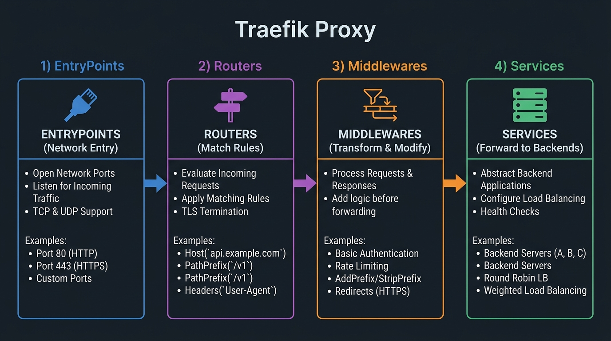

# 💡 Chapter 00 — What is Traefik?

Traefik is a modern HTTP reverse proxy and load balancer made to deploy microservices with ease. It simplifies networking by automatically discovering the right configuration for your services based on the platform you run them on (Docker, Kubernetes, Swarm, etc.).


---

## 👶 Beginner's Explanation (ELI5)
> *Think of Traefik as the **receptionist** at a massive office building. When a visitor (web request) arrives and asks for "Alice in Accounting" (app.example.com), Traefik looks at the directory and instantly points them to exactly the right room (Docker container).*

## 💡 Why do we need this?
> Without Traefik, you would have to manually open a port on your router (like 8080, 8081, 8082) for every single app you host, making URLs ugly and hard to remember.

---

---

## 🖼️ Architectural Overview


> **Diagram Explanation:** This diagram highlights the core concepts of Traefik. It shows how EntryPoints (ports) pass traffic to Routers (which apply rules based on domains), which then hand off to Middlewares (for logic like authentication) before finally being sent to Services (which load balance across your actual containers).

---

## 🏗️ The 4 Core Building Blocks of Traefik

```
[ Incoming Request (Port 80/443) ]
               │
      ┌────────▼────────┐
      │   EntryPoint    │ (Listens on ports, e.g. web/websecure)
      └────────┬────────┘
               │
      ┌────────▼────────┐
      │     Router      │ (Analyzes rules: Host(`api.app.com`))
      └────────┬────────┘
               │
      ┌────────▼────────┐
      │   Middleware    │ (Modifies request: Auth, StripPrefix, RateLimit)
      └────────┬────────┘
               │
      ┌────────▼────────┐
      │    Service      │ (Load balances to actual instances)
      └────────┬────────┘
               │
     ┌─────────┴─────────┐
     ▼                   ▼
[ Backend 1 ]       [ Backend 2 ] (Your running Docker containers)
```

1. **EntryPoints:** The network ports Traefik listens on (e.g., 80 for HTTP, 443 for HTTPS).
2. **Routers:** Analyze incoming requests (domains, paths) to route them to the right services.
3. **Middlewares:** Tweak the requests before sending them to the backend (authentication, headers, rate limiting).
4. **Services:** The abstraction that forwards requests to actual running server IPs and ports (load balancing).

---

## ⚙️ Static vs Dynamic Configuration

Traefik cleanly separates configuration into two types:

```
+---------------------------------------------------------+
|  STATIC CONFIGURATION  (traefik.yml / CLI flags)        |
|  * EntryPoints definitions (:80, :443)                  |
|  * Providers (docker, file, kubernetes)                 |
|  * Certificate resolvers (ACME Let's Encrypt)           |
|  * Log levels & Access logs                             |
|  Note: Loaded ONCE at startup (requires restart)        |
+---------------------------------------------------------+

+---------------------------------------------------------+
|  DYNAMIC CONFIGURATION  (Docker Labels / File Provider) |
|  * Routers & Host matching rules                        |
|  * Middlewares (Auth, Rate Limits, Headers)             |
|  * Services & Load balancing targets                    |
|  Note: Reloaded AUTOMATICALLY in real-time (no restart) |
+---------------------------------------------------------+
```

---

## Traefik vs Traditional Nginx

| Feature | Traefik | Traditional Nginx |
|---------|---------|-------------------|
| **Service Discovery** | Automated via Docker labels | Manual virtual host configuration |
| **SSL / Let's Encrypt** | Built-in automated ACME | External tools required (Certbot/cron) |
| **Dynamic Configuration** | Instant zero-downtime reloads | Reload/Restart signal needed |
| **Dashboard & Web UI** | Built-in real-time UI & REST API | Requires 3rd-party software |
| **Microservices Ready** | Native Docker, K8s, Nomad | Complex manual upstream management |

---

[🏠 Master Index](../../README.md) | [➡️ Next: Chapter 01 — Docker Routing](../01-docker-routing/README.md)