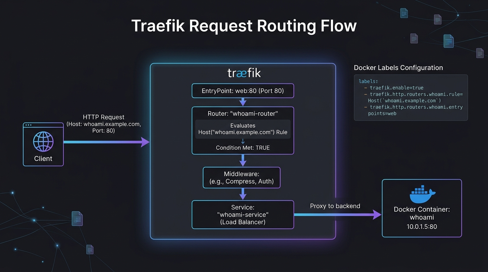

# 🐳 Chapter 01 — Routing to Docker Containers

Traefik shines with Docker. It listens to the Docker daemon and automatically generates routing rules based on the **labels** attached to your containers. No manual `nginx.conf` reloading is required!


---

## 👶 Beginner's Explanation (ELI5)
> *Imagine giving every employee in that office building a **sticky note** with their name on it. As soon as they walk in, the receptionist reads the sticky note and automatically knows where to send their mail. Docker labels are exactly those sticky notes!*

## 💡 Why do we need this?
> It prevents you from ever having to manually edit a configuration file or restart your proxy when you launch a new container.

---

---

## 🖼️ Docker Routing Architecture


> **Diagram Explanation:** The diagram illustrates how a client's request hits the Traefik proxy, which automatically queries the Docker Daemon. By matching the requested domain against the container's labels, Traefik natively routes traffic to the correct backend container without any manual configuration files.

---

## 🏗️ Docker Dynamic Auto-Discovery

```
[ Browser: app.example.com ]
            │
┌───────────▼───────────┐
│        Traefik        │ ── (Reads Docker Daemon events) ──┐
└───────────┬───────────┘                                   │
            │                                               ▼
            │ (Matches Host(`app.example.com`))   ┌───────────────────┐
            │                                     │ Docker Container  │
            └───────────────────────────────────▶ │  (nginx/whoami)   │
                                                  └───────────────────┘
```

---

## ⚙️ Docker Label Syntax

When running an application alongside Traefik, you tell Traefik how to route to it using Docker labels:

```yaml
labels:
  - "traefik.enable=true"
  - "traefik.http.routers.my-app.rule=Host(`app.example.com`)"
  - "traefik.http.routers.my-app.entrypoints=web"
  - "traefik.http.services.my-app.loadbalancer.server.port=80"
```

## 🚀 Demo Time: Step-by-Step Practical

**1. Start the Stack**
Open your terminal in this chapter's folder and run:
```bash
docker network create traefik
docker compose -f traefik-docker-compose.yml up -d
docker compose -f whoami-docker-compose.yml up -d
```

**2. Test the Routing**
Open your browser or run:
```bash
curl -H Host:whoami.example.com http://127.0.0.1
```
*(Note: If you don't have a local DNS or `/etc/hosts` entry for `whoami.example.com`, the `curl` command with the Host header perfectly simulates a real browser request!)*

**3. What Just Happened?**
- You sent an HTTP request on Port 80 to your local machine.
- Traefik intercepted it, read the `Host: whoami.example.com` header.
- Traefik looked at the Docker daemon, found the container with the matching label `traefik.http.routers.whoami.rule=Host(\`whoami.example.com\`)`.
- Traefik seamlessly forwarded the traffic to that container and returned the response.

**4. Teardown**
```bash
docker compose -f whoami-docker-compose.yml down
docker compose -f traefik-docker-compose.yml down
```

---

## 📁 Included Offline Example Stacks

- 📄 [`traefik.yml`](./traefik.yml) — Basic static config
- 🐳 [`traefik-docker-compose.yml`](./traefik-docker-compose.yml) — The core Traefik reverse proxy
- 🐳 [`whoami-docker-compose.yml`](./whoami-docker-compose.yml) — A simple HTTP testing app
- 🐳 [`nginx-docker-compose.yml`](./nginx-docker-compose.yml) — An Nginx container mapped dynamically
- 🐳 [`apache-docker-compose.yml`](./apache-docker-compose.yml) — An Apache container mapped dynamically
- 🐳 [`portainer-docker-compose.yml`](./portainer-docker-compose.yml) — Portainer Docker GUI mapped
- 🔒 [`.env.example`](./.env.example)

---

[⬅️ Chapter 00 — What is Traefik?](../00-what-is-traefik/README.md) | [🏠 Master Index](../../README.md) | [➡️ Next: Chapter 02 — Local IP Routing](../02-local-ip-routing/README.md)