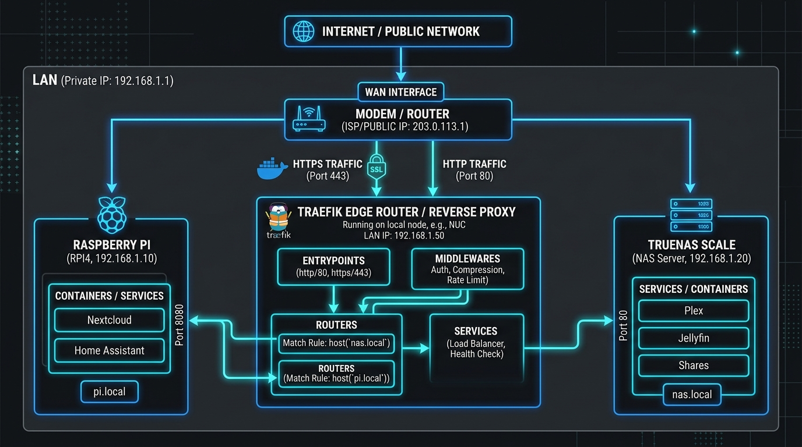

# 🖥️ Chapter 02 — Routing to Local IP Addresses

Sometimes you have applications that aren't running in Docker (e.g., a physical NAS, a Raspberry Pi, a virtual machine on your LAN, or a TrueNAS server). Traefik can route traffic to these using the **File Provider** (`dynamic_conf`).


---

## 👶 Beginner's Explanation (ELI5)
> *Not everyone works in the main office building! Sometimes the receptionist needs to route a visitor to an **off-site warehouse** across town. The File Provider allows Traefik to route traffic to things running entirely outside of Docker.*

## 💡 Why do we need this?
> If you have a Raspberry Pi running Pi-Hole on your network, or a physical TrueNAS server, you can still give them beautiful URLs like `nas.yourdomain.com` without them needing to be Docker containers.

---

## 🖼️ Architecture Diagram


> **Diagram Explanation:** A high-level technical visualization of the concepts discussed in this chapter.

---

---

## 🏗️ External IP Routing Flow

```
[ Browser: router.example.com ]
            │
┌───────────▼───────────┐
│        Traefik        │ ── (Reads dynamic_conf.yml)
└───────────┬───────────┘
            │
            │ (Routes to external IP over LAN)
            ▼
┌────────────────────────┐
│ External Server / VM   │
│   (192.168.1.100:80)   │
└────────────────────────┘
```

---

## ⚙️ Configuration Setup

### Dynamic File Config (`dynamic_conf/my-external-app.yml`)
```yaml
http:
  routers:
    router-gui:
      rule: "Host(`router.example.com`)"
      service: router-svc
      entryPoints:
        - web

  services:
    router-svc:
      loadBalancer:
        servers:
          - url: "http://192.168.1.254:80"
```

## 🚀 Demo Time: Step-by-Step Practical

**1. Start the Stack**
Open your terminal in this chapter's folder and run:
```bash
cp -a .env.example .env
docker compose -f traefik-docker-compose.yml up -d
```

**2. Test the Routing**
Run the following curl command:
```bash
curl -H Host:router.example.com http://127.0.0.1
```
*(Ensure you modify `dynamic_conf/my-external-app.yml` to point to a real IP address on your LAN that serves a webpage, otherwise you will get a 502 Bad Gateway).*

**3. Teardown**
```bash
docker compose -f traefik-docker-compose.yml down
```

---

## 📁 Included Offline Example Stacks

- 📄 [`traefik.yml`](./traefik.yml) — Configured to watch the `dynamic_conf` directory
- 🐳 [`traefik-docker-compose.yml`](./traefik-docker-compose.yml) — Traefik mounting the dynamic directory
- 🔒 [`.env.example`](./.env.example)

---

[⬅️ Chapter 01 — Docker Routing](../01-docker-routing/README.md) | [🏠 Master Index](../../README.md) | [➡️ Next: Chapter 03 — Middlewares](../03-middlewares-basicauth/README.md)