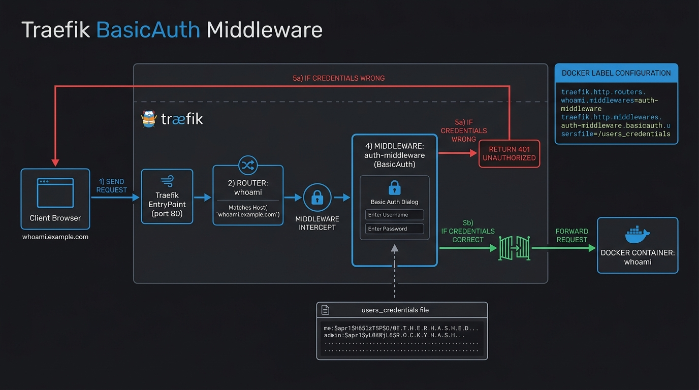

# 🔑 Chapter 03 — Middlewares (BasicAuth)

Middlewares are pieces of logic that modify a request before it hits your service. The most common middleware is **BasicAuth**, which places a username/password prompt in front of an application.


---

## 👶 Beginner's Explanation (ELI5)
> *A middleware is like a **bouncer** standing at the door of a club. The receptionist (Router) gives you directions to the club, but the bouncer checks your ID (username/password) before letting you inside.*

## 💡 Why do we need this?
> Some apps (like internal dashboards or databases) do not have their own login screens! BasicAuth protects them from the public internet.

---

---

## 🖼️ BasicAuth Architecture


> **Diagram Explanation:** Shows the exact moment the middleware intercepts the traffic. Before the service receives the request, the Traefik middleware challenges the user for credentials against a `.htpasswd` file, effectively blocking unauthorized access at the perimeter.

---

## 🏗️ Middleware Execution Flow

```
[ Browser ] ────▶ ┌───────────────┐
                  │ Traefik Proxy │
                  └───────┬───────┘
                          │ (Route matches)
                          ▼
                  ┌───────────────┐
                  │  BasicAuth    │ ◀── (Rejects invalid password with 401 Unauthorized)
                  │  Middleware   │
                  └───────┬───────┘
                          │ (If authenticated)
                          ▼
                  ┌───────────────┐
                  │  Backend App  │
                  └───────────────┘
```

---

## ⚙️ Configuration Setup

### Step 1 — Generate a Password Hash
Traefik requires hashed passwords (`htpasswd`). Generate one:
```bash
echo $(htpasswd -nB user) | sed -e s/\\$/\\$\\$/g
```

### Step 2 — Define the Middleware
```yaml
labels:
  - "traefik.enable=true"
  - "traefik.http.routers.my-app.rule=Host(`app.example.com`)"
  # 1. Define the middleware
  - "traefik.http.middlewares.my-auth.basicauth.users=user:$$2y$$05$$..."
  # 2. Apply it to the router
  - "traefik.http.routers.my-app.middlewares=my-auth"
```

---

## 📁 Included Offline Example Stacks

- 📄 [`users_credentials`](./users_credentials) — File containing hashed passwords
- 🐳 [`traefik-docker-compose.yml`](./traefik-docker-compose.yml) — Basic Traefik setup
- 🐳 [`whoami-docker-compose.yml`](./whoami-docker-compose.yml) — Test app protected by inline labels
- 🐳 [`nginx-docker-compose.yml`](./nginx-docker-compose.yml) — Test app protected by `users_credentials` file
- 🔒 [`.env.example`](./.env.example)

---

[⬅️ Chapter 02 — Local IP Routing](../02-local-ip-routing/README.md) | [🏠 Master Index](../../README.md) | [➡️ Next: Chapter 04 — Let's Encrypt HTTP](../04-letsencrypt-http-challenge/README.md)