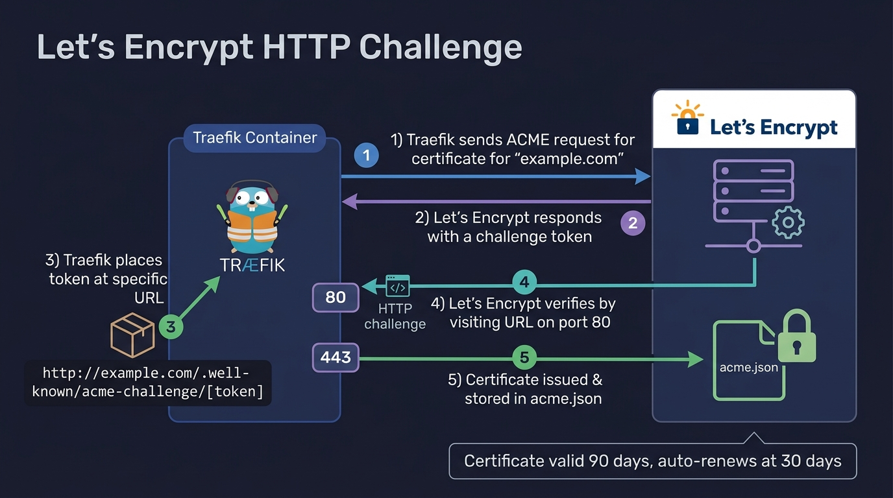

# 🔒 Chapter 04 — Let's Encrypt (HTTP Challenge)

Traefik can automatically request and renew free SSL certificates from **Let's Encrypt** using the **HTTP-01 Challenge**. This is the simplest way to get SSL for public-facing domains.


---

## 👶 Beginner's Explanation (ELI5)
> *Let's Encrypt is a trusted ID badge printer. Traefik asks for a badge (SSL cert), and Let's Encrypt says, "Prove you own this building by putting a **specific statue in the front window (Port 80)** where I can see it." Traefik does this automatically.*

## 💡 Why do we need this?
> To get the green padlock (HTTPS) in your browser so passwords and private data aren't stolen by hackers on public Wi-Fi.

---

---

## 🖼️ HTTP Challenge Architecture


> **Diagram Explanation:** This diagram visualizes the HTTP-01 challenge process. Traefik requests a certificate, and Let's Encrypt sends a verification token. Traefik automatically creates a temporary route on port 80 to host this token so Let's Encrypt can verify domain ownership over the public internet.

---

## 🏗️ ACME HTTP-01 Validation Flow

```
[ Let's Encrypt Server ]
         │
         │ 1. Traefik says: "I own app.example.com"
         │ 2. LE says: "Prove it. Put token X at http://app.example.com/.well-known/acme-challenge/Y"
         ▼
 ┌───────────────┐
 │    Traefik    │ ─── 3. Intercepts HTTP request from LE
 └───────┬───────┘
         │
         │ 4. Traefik serves the token on Port 80 automatically
         ▼
[ SSL Issued and saved to acme.json! ]
```

⚠️ **Requirement:** Port 80 *must* be open and accessible from the public internet for Let's Encrypt to verify the token.

---

## ⚙️ Configuration Setup

### Step 1 — Define Certificate Resolver (`traefik.yml`)
```yaml
certificatesResolvers:
  my-resolver:
    acme:
      email: your-email@example.com
      storage: /acme.json
      httpChallenge:
        entryPoint: web
```

### Step 2 — Request Certs for a Container
Switch the entrypoint to `websecure` (port 443) and specify the resolver:

```yaml
labels:
  - "traefik.enable=true"
  - "traefik.http.routers.my-app.entrypoints=websecure"
  - "traefik.http.routers.my-app.rule=Host(`app.example.com`)"
  - "traefik.http.routers.my-app.tls.certresolver=my-resolver"
```

---

## 📁 Included Offline Example Stacks

- 📄 [`traefik.yml`](./traefik.yml) — Static config with HTTP challenge resolver
- 🐳 [`traefik-docker-compose.yml`](./traefik-docker-compose.yml) — Mounts `acme.json` for certificate storage
- 🐳 [`whoami-docker-compose.yml`](./whoami-docker-compose.yml) — Example app with `certresolver` label
- 🐳 [`nginx-docker-compose.yml`](./nginx-docker-compose.yml)
- 🔒 [`.env.example`](./.env.example)

---

[⬅️ Chapter 03 — Middlewares](../03-middlewares-basicauth/README.md) | [🏠 Master Index](../../README.md) | [➡️ Next: Chapter 05 — Let's Encrypt DNS](../05-letsencrypt-dns-challenge-cloudflare/README.md)