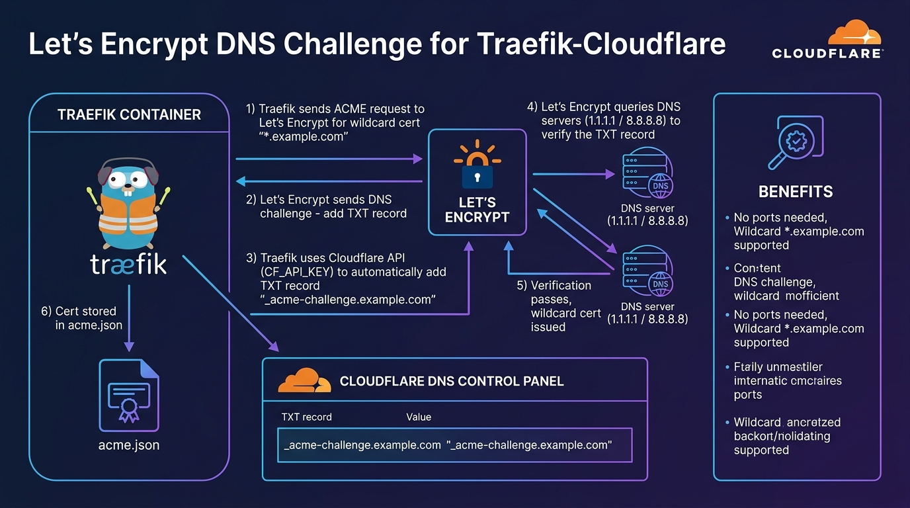

# 🌐 Chapter 05 — Let's Encrypt (DNS Challenge & Wildcards)

The **DNS-01 Challenge** proves domain ownership by creating a temporary TXT record in your DNS provider (like Cloudflare). 
It is required if you want **Wildcard SSL Certificates** (`*.example.com`) or if your Traefik server is on a private intranet/home lab without Port 80 exposed.


---

## 👶 Beginner's Explanation (ELI5)
> *Instead of putting a statue in the front window (which requires Port 80 to be open to the world), Traefik calls your **landlord (Cloudflare DNS)** and has them temporarily update the public registry to prove you own the building.*

## 💡 Why do we need this?
> This is required if your internet provider blocks Port 80, or if you want a "Wildcard" certificate that instantly secures literally every subdomain (`*.yourdomain.com`) automatically!

---

---

## 🖼️ DNS Challenge Architecture


> **Diagram Explanation:** Shows how Traefik uses a DNS provider API (like Cloudflare) to create a temporary TXT record. Let's Encrypt verifies this record globally, meaning your server doesn't even need port 80 exposed to the internet to get a secure wildcard certificate.

---

## 🏗️ ACME DNS-01 Validation Flow

```
[ Traefik Proxy ] ── 1. Tells LE "I want SSL for *.example.com"
         │
         │ 2. LE replies: "Create DNS TXT record: _acme-challenge=XYZ"
         │
         ▼
[ Cloudflare API ] ── 3. Traefik automatically creates TXT record using API key
         │
         │
[ Let's Encrypt ] ─── 4. Verifies TXT record via global DNS lookup
         │
         ▼
[ SSL Issued and saved to acme.json! ]
```

---

## ⚙️ Configuration Setup

### Step 1 — Define DNS Resolver (`traefik.yml`)
```yaml
certificatesResolvers:
  cloudflare:
    acme:
      email: your-email@example.com
      storage: /acme.json
      dnsChallenge:
        provider: cloudflare
        resolvers:
          - "1.1.1.1:53"
          - "8.8.8.8:53"
```

### Step 2 — Provide API Credentials
Traefik reads the provider's API keys via environment variables (e.g. `CF_API_EMAIL` and `CF_API_KEY` for Cloudflare).

### Step 3 — Request Wildcard Certs for a Container
```yaml
labels:
  - "traefik.enable=true"
  - "traefik.http.routers.my-app.rule=Host(`app.example.com`)"
  - "traefik.http.routers.my-app.tls.certresolver=cloudflare"
  - "traefik.http.routers.my-app.tls.domains[0].main=example.com"
  - "traefik.http.routers.my-app.tls.domains[0].sans=*.example.com"
```

---

## 🚀 Demo Time: Step-by-Step Practical

⚠️ **Prerequisite:** You need a registered domain name managed by Cloudflare DNS, and a valid Cloudflare API Token.

**1. Prepare the Environment**
Rename `.env.example` to `.env` and insert your Cloudflare API Email and API Key.

**2. Start the Stack**
```bash
docker compose -f traefik-docker-compose.yml up -d
docker compose -f whoami-docker-compose.yml up -d
```

**3. Test the Wildcard SSL**
Open `https://app.yourdomain.com`. Look at the SSL certificate details in your browser; you will see it was issued for `*.yourdomain.com`!

**4. Teardown**
```bash
docker compose -f whoami-docker-compose.yml down
docker compose -f traefik-docker-compose.yml down
```

---

## 📁 Included Offline Example Stacks

- 📄 [`traefik.yml`](./traefik.yml) — Static config with Cloudflare DNS resolver
- 🐳 [`traefik-docker-compose.yml`](./traefik-docker-compose.yml) — Traefik injecting CF credentials
- 🐳 [`whoami-docker-compose.yml`](./whoami-docker-compose.yml) — Requests wildcard cert
- 🔒 [`.env.example`](./.env.example)

---

[⬅️ Chapter 04 — Let's Encrypt HTTP](../04-letsencrypt-http-challenge/README.md) | [🏠 Master Index](../../README.md) | [➡️ Next: Chapter 06 — Redirect HTTP to HTTPS](../06-http-to-https-redirect/README.md)