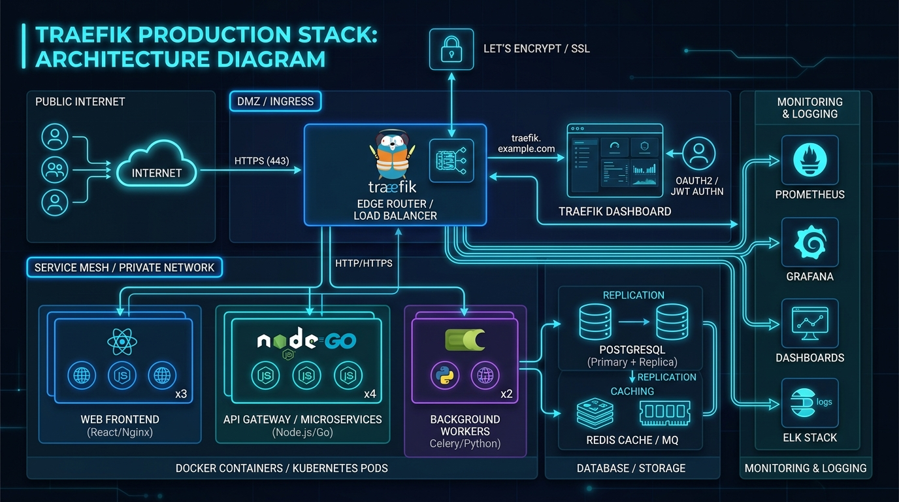

# 📊 Chapter 07 — Production-Ready Stack & Dashboard

This chapter pulls everything together into a **unified production stack**. We will deploy Traefik with HTTP-to-HTTPS redirection, Cloudflare DNS-01 wildcard certificates, and secure the built-in **Traefik Dashboard** behind a BasicAuth middleware.


---

## 👶 Beginner's Explanation (ELI5)
> *This is putting everything together into a **fully operational fortress**. We have the receptionist, the bouncer, the ID badges, and all the rooms configured perfectly.*

## 💡 Why do we need this?
> This is the exact boilerplate template you would deploy to a live virtual private server (VPS) on the internet to host your actual applications securely.

---

## 🖼️ Architecture Diagram


> **Diagram Explanation:** A high-level technical visualization of the concepts discussed in this chapter.

---

---

## 🏗️ Production Architecture Flow

```
[ Public Request: https://app.example.com ]
                  │
          ┌───────▼───────┐
          │ Traefik Proxy │ (Handles Wildcard SSL `*.example.com`)
          └───────┬───────┘
                  │
         (Matches Host rules)
         /        │         \
        /         │          \
       ▼          ▼           ▼
[ App 1 ]      [ App 2 ]   [ Traefik Dashboard ]
                            (Protected by BasicAuth)
```

---

## ⚙️ Securing the Traefik Dashboard

Enable the API/Dashboard in `traefik.yml` securely (without `insecure: true`):

```yaml
api:
  dashboard: true
  debug: false
```

Create a dynamic router for it in `traefik-docker-compose.yml`:

```yaml
labels:
  - "traefik.enable=true"
  - "traefik.http.routers.traefik-dash.rule=Host(`traefik.$MY_DOMAIN`)"
  - "traefik.http.routers.traefik-dash.service=api@internal"
  - "traefik.http.routers.traefik-dash.entrypoints=websecure"
  - "traefik.http.routers.traefik-dash.tls.certresolver=cloudflare"
  - "traefik.http.routers.traefik-dash.middlewares=dash-auth"
  - "traefik.http.middlewares.dash-auth.basicauth.usersfile=/users_credentials"
```

---

## 📁 Included Offline Example Stacks

- 📄 [`traefik.yml`](./traefik.yml) — Production static config
- 📄 [`users_credentials`](./users_credentials) — Dashboard admin passwords
- 🐳 [`traefik-docker-compose.yml`](./traefik-docker-compose.yml) — Master reverse proxy stack
- 🐳 [`docker-compose.apps.yml`](./docker-compose.apps.yml) — Deploying applications behind the proxy
- 🔒 [`.env.example`](./.env.example)

---

[⬅️ Chapter 06 — Redirect HTTP to HTTPS](../06-http-to-https-redirect/README.md) | [🏠 Master Index](../../README.md) | [➡️ Next: Chapter 08 — Advanced Config](../08-advanced-configuration/README.md)