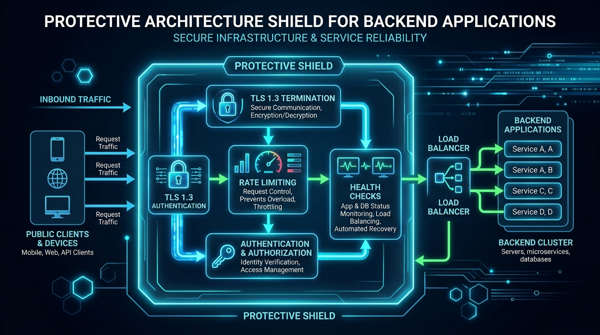

# ⚙️ Chapter 08 — Advanced Configuration & Security

Hardening Traefik for strict security compliance (A+ on SSL Labs), implementing **Rate Limiting** to prevent DDoS/brute forcing, and adding **Health Checks** for backend resiliency.


---

## 👶 Beginner's Explanation (ELI5)
> *The bouncer gets an upgrade. Now they drop anyone who tries to scan the building too fast (**Rate Limiting**), check if rooms are on fire before sending people there (**Health Checks**), and enforce strict security protocols (**TLS 1.3**).*

## 💡 Why do we need this?
> To protect your apps from script kiddies, DDoS attacks, and to get an A+ rating on corporate security audits like SSL Labs.

---

## 🖼️ Architecture Diagram


> **Diagram Explanation:** A high-level technical visualization of the concepts discussed in this chapter.

---

---

## 🏗️ Security & Resiliency Pipeline

```
[ Inbound Request ]
        │
┌───────▼────────┐
│ TLS Middleware │ ──▶ Enforces TLS 1.3 / Strict Ciphers / ALPN
└───────┬────────┘
        │
┌───────▼────────┐
│  Rate Limiter  │ ──▶ Drops traffic if > 100 requests / second (429 Too Many Requests)
└───────┬────────┘
        │
┌───────▼────────┐
│ Backend Health │ ──▶ Traefik continuously polls `/ping`.
│    Checker     │     If Backend A is dead, routes 100% traffic to Backend B.
└───────┬────────┘
        │
┌───────▼────────┐
│  Backend App   │
└────────────────┘
```

---

## ⚙️ Configuration Setup

### 1. Hardened TLS Profile (`dynamic-tls-and-headers.yml`)
```yaml
tls:
  options:
    default:
      minVersion: VersionTLS12
      cipherSuites:
        - TLS_ECDHE_RSA_WITH_AES_128_GCM_SHA256
        - TLS_ECDHE_RSA_WITH_AES_256_GCM_SHA384
```

### 2. Security Headers Middleware
```yaml
http:
  middlewares:
    security-headers:
      headers:
        stsSeconds: 31536000
        stsIncludeSubdomains: true
        contentTypeNosniff: true
        browserXssFilter: true
```

### 3. Rate Limiting Container Labels
```yaml
labels:
  - "traefik.http.middlewares.my-rate-limit.ratelimit.average=100"
  - "traefik.http.middlewares.my-rate-limit.ratelimit.burst=50"
  - "traefik.http.routers.my-app.middlewares=my-rate-limit"
```

---

## 📁 Included Offline Example Stacks

- 📄 [`traefik.yml`](./traefik.yml) — Base static config
- 📄 [`dynamic-tls-and-headers.yml`](./dynamic-tls-and-headers.yml) — Dynamic definitions for TLS and Security Headers
- 🐳 [`traefik-docker-compose.yml`](./traefik-docker-compose.yml)
- 🐳 [`ratelimit-app-docker-compose.yml`](./ratelimit-app-docker-compose.yml) — Tests rate limiting (HTTP 429)
- 🐳 [`healthcheck-app-docker-compose.yml`](./healthcheck-app-docker-compose.yml) — Tests backend resiliency
- 🔒 [`.env.example`](./.env.example)

---

[⬅️ Chapter 07 — Production Stack](../07-production-ready-stack/README.md) | [🏠 Master Index](../../README.md) | [➡️ Next: Chapter 09 — Troubleshooting](../09-troubleshooting-and-diagnostics/README.md)