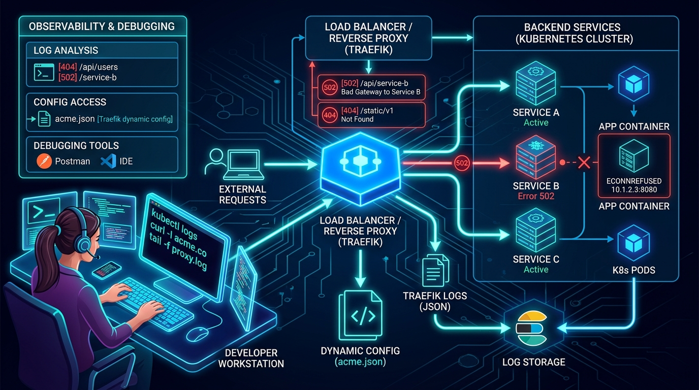

# 🩺 Chapter 09 — Troubleshooting & Diagnostics

When Traefik returns a `404 Not Found`, a `502 Bad Gateway`, or fails to fetch SSL certificates, you need the right tools to debug the pipeline.


---

## 👶 Beginner's Explanation (ELI5)
> *When the receptionist gets confused and gives a visitor a "404 Not Found" error, you need the blueprints and **security camera footage (Logs)** to figure out exactly where the miscommunication happened.*

## 💡 Why do we need this?
> Because things will eventually break. Knowing how to read the logs and inspect the certificates is the difference between a 5-minute fix and a 5-hour headache.

---

## 🖼️ Architecture Diagram


> **Diagram Explanation:** A high-level technical visualization of the concepts discussed in this chapter.

---

---

## 🏗️ Traefik Debugging Pipeline

```
[ HTTP 404 / 502 ]
        │
┌───────▼─────────────────┐
│ 1. Check Traefik Logs   │ ──▶ `docker logs traefik` (Look for ACME errors)
├─────────────────────────┤
│ 2. Check App Logs       │ ──▶ `docker logs my-app` (Did the app crash?)
├─────────────────────────┤
│ 3. Inspect acme.json    │ ──▶ Is the certificate actually there?
├─────────────────────────┤
│ 4. Check Traefik UI     │ ──▶ `https://traefik.example.com` (Are routers red/green?)
└─────────────────────────┘
```

---

## ⚙️ Configuration Setup

### Step 1 — Enable Debug Logging
Change `traefik.yml`:
```yaml
log:
  level: DEBUG
```

### Step 2 — Use the `acme.json` Inspector Script
We've included a Python script to safely parse your `acme.json` to verify if Let's Encrypt successfully gave you a certificate, without messing up the file formatting.

```bash
python diag-inspect-acme.py ../05-letsencrypt-dns-challenge-cloudflare/acme.json
```

---

## 📁 Included Offline Example Stacks

- 📄 [`traefik-debug.yml`](./traefik-debug.yml) — Configuration with DEBUG level logging
- 🐳 [`traefik-debug-docker-compose.yml`](./traefik-debug-docker-compose.yml)
- 🐍 [`diag-inspect-acme.py`](./diag-inspect-acme.py) — Python script to read ACME certs safely
- 📜 [`diag-test-routing.sh`](./diag-test-routing.sh) — Bash script to test container networking
- 📜 [`diag-test-routing.ps1`](./diag-test-routing.ps1) — PowerShell script equivalent

---

[⬅️ Chapter 08 — Advanced Config](../08-advanced-configuration/README.md) | [🏠 Master Index](../../README.md) | [➡️ Next: Chapter 10 — Master Cheat Sheet](../10-quick-reference-and-cheat-sheet/README.md)