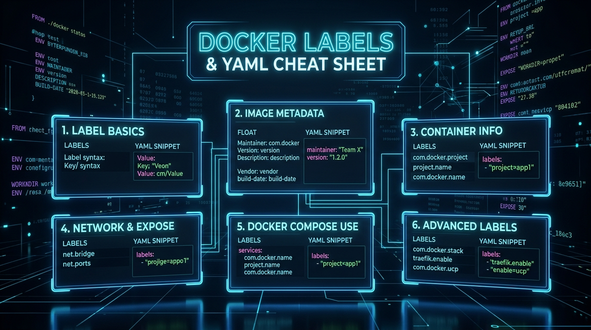

# ⚡ Chapter 10 — Quick Reference & Master Cheat Sheet

A comprehensive collection of Traefik's most used rules, boilerplates, and middleware configurations.


---

## 👶 Beginner's Explanation (ELI5)
> *A quick-reference **pocket guide** for everything you've learned. Like a dictionary for Traefik code.*

## 💡 Why do we need this?
> Because no one remembers exact YAML syntax for everything. You will copy and paste from this folder constantly.

---

## 🖼️ Architecture Diagram


> **Diagram Explanation:** A high-level technical visualization of the concepts discussed in this chapter.

---

---

## 🏗️ The Docker Label Anatomy

```
traefik . http . routers . my-app . rule = Host(`app.com`)
   │        │       │         │       │          │
 (Core) (Protocol) (Type)   (Name) (Property)  (Value)
```

---

## ⚙️ Rule Syntax Cheat Sheet

| Match Type | Label Syntax | Example |
|------------|--------------|---------|
| **Domain** | `Host(\`app.com\`)` | Match exact domain |
| **Subdomains** | `HostRegexp(\`{subdomain:[a-z]+}.app.com\`)` | Match regex domains |
| **Path** | `Path(\`/api\`)` | Exact path match `/api` |
| **Path Prefix** | `PathPrefix(\`/api\`)` | Matches `/api`, `/api/v1`, etc. |
| **Headers** | `Headers(\`X-API-Key\`, \`123\`)` | Matches specific request headers |
| **Multiple Rules** | `Host(\`app.com\`) && PathPrefix(\`/api\`)` | AND logic combination |

---

## 🚀 Demo Time: Step-by-Step Practical

This chapter acts as a reference library. There is no stack to deploy here!

**What to do next:**
Keep the `CHEAT_SHEET.md` open in a side panel whenever you are building a new `docker-compose.yml` file to quickly copy-paste labels and syntax.

---

## 📁 Included Offline Example Stacks

- 📄 [`CHEAT_SHEET.md`](./CHEAT_SHEET.md) — Comprehensive offline label and syntax reference
- 📄 [`traefik-production-template.yml`](./traefik-production-template.yml) — Production-ready `traefik.yml` boilerplate
- 📄 [`common-middlewares.yml`](./common-middlewares.yml) — Reusable middlewares (security, compress, basicauth)
- 🐳 [`docker-compose.template.yml`](./docker-compose.template.yml) — Copy-paste template for new apps

---

[⬅️ Chapter 09 — Troubleshooting](../09-troubleshooting-and-diagnostics/README.md) | [🏠 Master Index](../../README.md) | [➡️ Next: Chapter 11 — TCP/UDP Routing](../11-tcp-udp-routing/README.md)