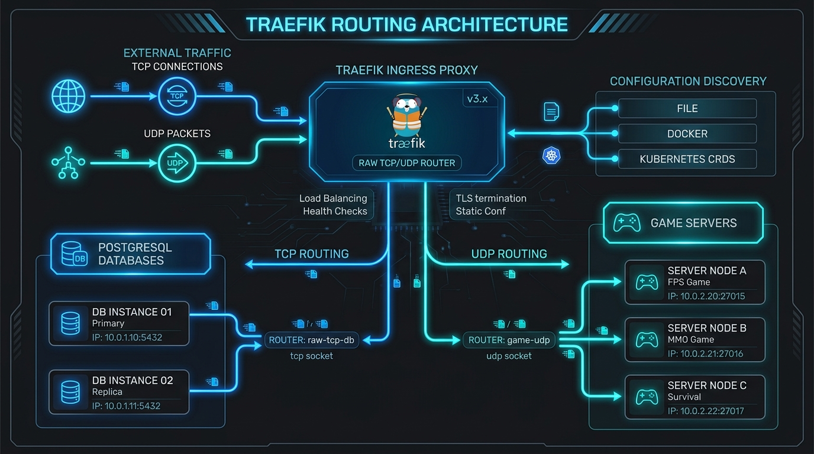

# 🔌 Chapter 11 — TCP & UDP Routing (Non-HTTP Backends)

Traefik is not limited to standard HTTP/HTTPS traffic. It functions as a high-performance **TCP and UDP Layer-4 reverse proxy** capable of routing databases (PostgreSQL, MySQL, Redis), game servers (Minecraft), SSH bastions, and DNS servers.


---

## 👶 Beginner's Explanation (ELI5)
> *Traefik isn't just for websites (HTTP)! It can also act as a traffic cop for **specialized trucks (TCP/UDP)** carrying database files, game server data, or SSH connections.*

## 💡 Why do we need this?
> If you want to host a Minecraft server or a PostgreSQL database and route it securely through a single open port without exposing the backend directly.

---

## 🖼️ Architecture Diagram


> **Diagram Explanation:** A high-level technical visualization of the concepts discussed in this chapter.

---

---

## 🏗️ TCP & UDP Architectural Flow

```
[ Inbound TCP/UDP Traffic ]
             │
             ├─── [ Port 5432 ] ───▶ [ HostSNI: postgres.example.com ] ───▶ [ PostgreSQL DB ]
             │                             (TLS Terminated)
             │
             ├─── [ Port 6379 ] ───▶ [ HostSNI: * ] ──────────────────────▶ [ Redis Cache ]
             │                             (Raw Non-TLS TCP)
             │
             └─── [ Port 25565/UDP ] ────────────────────────────────────▶ [ Minecraft Server ]
                                           (Direct UDP Stream)
```

---

## 📋 Protocol Comparison Matrix

| Protocol | Router Type | Rule Syntax | TLS Handling Options |
|----------|-------------|-------------|----------------------|
| **HTTP / HTTPS** | `http.routers` | `Host(\`app.com\`)` | Terminated at Traefik or forwarded |
| **TCP with SNI** | `tcp.routers` | `HostSNI(\`db.example.com\`)` | Terminated at Traefik (TLS certificates) |
| **TCP Passthrough** | `tcp.routers` | `HostSNI(\`secure.example.com\`)` | `passthrough: true` (Encrypted to backend) |
| **Raw TCP** | `tcp.routers` | `HostSNI(\`*\`)` | Plain unencrypted stream forwarding |
| **UDP Streams** | `udp.routers` | (None — direct port mapping) | Raw UDP datagram routing |

---

## ⚙️ Configuration Examples

### 1. TCP Routing with TLS Termination & SNI Multiplexing
```yaml
labels:
  - "traefik.enable=true"
  - "traefik.tcp.routers.postgres.entrypoints=postgres"
  - "traefik.tcp.routers.postgres.rule=HostSNI(`postgres.$MY_DOMAIN`)"
  - "traefik.tcp.routers.postgres.tls=true"
  - "traefik.tcp.routers.postgres.tls.certresolver=lets-encr"
  - "traefik.tcp.services.postgres.loadbalancer.server.port=5432"
```

### 2. TCP Routing with TLS Passthrough (End-to-End Encryption)
```yaml
labels:
  - "traefik.enable=true"
  - "traefik.tcp.routers.secure-app.entrypoints=websecure"
  - "traefik.tcp.routers.secure-app.rule=HostSNI(`secure.$MY_DOMAIN`)"
  - "traefik.tcp.routers.secure-app.tls.passthrough=true"
  - "traefik.tcp.services.secure-app.loadbalancer.server.port=8443"
```

### 3. Raw TCP Stream (Non-TLS)
```yaml
labels:
  - "traefik.enable=true"
  - "traefik.tcp.routers.redis.entrypoints=redis"
  - "traefik.tcp.routers.redis.rule=HostSNI(`*`)"
  - "traefik.tcp.services.redis.loadbalancer.server.port=6379"
```

---

## 📁 Included Offline Example Stacks

- 📄 [`traefik.yml`](./traefik.yml) — Static configuration with custom TCP/UDP entrypoints
- 🐳 [`traefik-docker-compose.yml`](./traefik-docker-compose.yml) — Compose stack with exposed ports
- 🐘 [`postgres-docker-compose.yml`](./postgres-docker-compose.yml) — PostgreSQL with SNI TLS router
- ⚡ [`redis-docker-compose.yml`](./redis-docker-compose.yml) — Redis raw TCP router
- 🔒 [`.env.example`](./.env.example)

---

[⬅️ Chapter 10 — Quick Reference](../10-quick-reference-and-cheat-sheet/README.md) | [🏠 Master Index](../../README.md) | [➡️ Next: Chapter 12 — Observability & Metrics](../12-observability-metrics-tracing/README.md)
