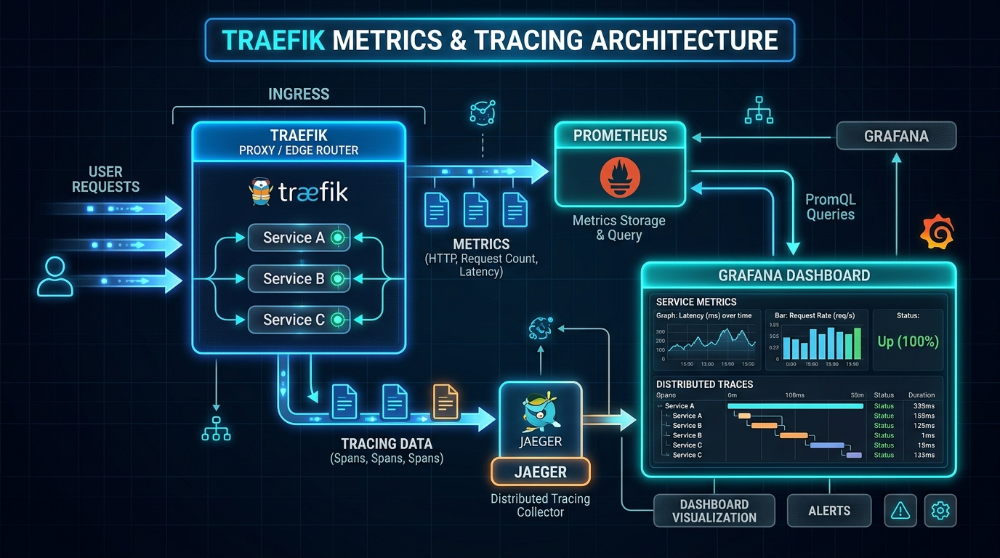

# 📊 Chapter 12 — Observability: Metrics, Tracing & Access Logs

Production deployments require complete visibility into traffic rates, request latency, error distribution, and distributed service dependencies. Traefik provides built-in exporters for **Prometheus**, **OpenTelemetry / Jaeger Tracing**, and **Structured JSON Access Logs**.


---

## 👶 Beginner's Explanation (ELI5)
> *Adding a **control room** with massive screens showing you exactly how many visitors are entering the building, which rooms are getting the most traffic, and how fast they are walking (response times).*

## 💡 Why do we need this?
> To visually monitor the health of your servers using gorgeous Grafana dashboards and instantly spot if an app is slowing down.

---

## 🖼️ Architecture Diagram


> **Diagram Explanation:** A high-level technical visualization of the concepts discussed in this chapter.

---

---

## 🏗️ Observability Architecture

```
                      ┌──────────────────────────────────────────────┐
                      │              Traefik Proxy                   │
                      │  • Port 80 / 443 Traffic                     │
                      │  • Internal Scrape Port (:8082)              │
                      └───────┬───────────────────┬───────────┬──────┘
                              │                   │           │
                     (Metrics Scrape)         (OTLP gRPC) (JSON File)
                              │                   │           │
                              ▼                   ▼           ▼
                      ┌───────────────┐   ┌───────────────┐ ┌───────────────┐
                      │  Prometheus   │   │ Jaeger / OTel │ │  Access Logs  │
                      │  (Port 9090)  │   │ (Port 16686)  │ │ (/var/log/..) │
                      └───────┬───────┘   └───────────────┘ └───────────────┘
                              │
                              ▼
                      ┌───────────────┐
                      │    Grafana    │
                      │  (Port 3000)  │
                      └───────────────┘
```

---

## 1. 📈 Prometheus Metrics Configuration

Enable Prometheus scraping in `traefik.yml`:

```yaml
metrics:
  prometheus:
    entryPoint: metrics      # Internal port :8082
    addEntryPointsLabels: true
    addRoutersLabels: true
    addServicesLabels: true
    buckets:
      - 0.05
      - 0.1
      - 0.3
      - 1.2
      - 5.0
```

Prometheus can scrape endpoints at `http://traefik:8082/metrics`.

---

## 2. 🔍 Distributed Tracing (OpenTelemetry & Jaeger)

Track request lifecycles across microservices:

```yaml
tracing:
  openTelemetry:
    address: "jaeger:4317"
    insecure: true
    grpc: true
```

---

## 3. 📜 Structured Access Logs with Filtering

Capture detailed transaction logs formatted in JSON while filtering out noisy health checks:

```yaml
accessLog:
  filePath: "/var/log/traefik/access.log"
  format: json
  bufferingSize: 100
  filters:
    statusCodes:
      - "400-499"   # Client errors
      - "500-599"   # Server errors
    retryAttempts: true
    minDuration: "10ms"
  fields:
    defaultMode: keep
    headers:
      defaultMode: keep
      names:
        User-Agent: keep
        Authorization: redact
```

---

## 🚀 Demo Time: Step-by-Step Practical

**1. Start the Stack**
```bash
docker compose -f observability-docker-compose.yml up -d
```

**2. Test the Control Room**
- **Grafana:** Navigate to `http://localhost:3000`. You will see pre-built dashboards showing request rates, 404 errors, and latency charts.
- **Jaeger:** Navigate to `http://localhost:16686`. Send a few web requests to your apps, then search Jaeger to see a visual timeline of exactly how long Traefik took to process the request!

**3. Teardown**
```bash
docker compose -f observability-docker-compose.yml down
```

---

## 📁 Included Offline Example Stacks

- 📄 [`traefik.yml`](./traefik.yml) — Production static config with metrics & tracing
- 🐳 [`traefik-docker-compose.yml`](./traefik-docker-compose.yml) — Traefik + Prometheus + Jaeger stack
- 📊 [`prometheus.yml`](./prometheus.yml) — Scraper target configuration
- 🔒 [`.env.example`](./.env.example)

---

[⬅️ Chapter 11 — TCP & UDP Routing](../11-tcp-udp-routing/README.md) | [🏠 Master Index](../../README.md) | [➡️ Next: Chapter 13 — SSO & ForwardAuth](../13-sso-forwardauth-authelia/README.md)
