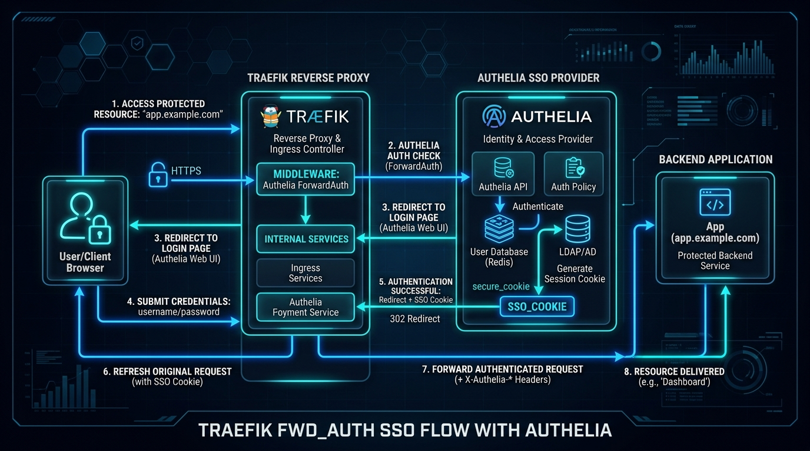

# 🔐 Chapter 13 — Single Sign-On (SSO) with ForwardAuth & Authelia

Replace basic HTTP authentication with a centralized **2-Factor Authentication (2FA/MFA) SSO Portal** using **Authelia** and Traefik's `forwardauth` middleware.


---

## 👶 Beginner's Explanation (ELI5)
> *Instead of showing your ID to every single bouncer at every single room (BasicAuth), you check in at the front desk once, get an **all-access VIP wristband (Authelia)**, and walk through any door seamlessly!*

## 💡 Why do we need this?
> Logging into 15 different self-hosted apps individually is annoying. Single Sign-On (SSO) combined with 2-Factor Authentication makes your server feel like a professional enterprise ecosystem.

---

## 🖼️ Architecture Diagram


> **Diagram Explanation:** A high-level technical visualization of the concepts discussed in this chapter.

---

---

## 🏗️ ForwardAuth Authentication Flow

```
[ User Browser ]
       │  1. Request: https://whoami.example.com
       ▼
┌──────────────┐
│   Traefik    │
└──────┬───────┘
       │  2. ForwardAuth verification request
       ▼
┌──────────────┐
│   Authelia   │ ──── (If unauthenticated) ────▶ Redirect to https://auth.example.com (2FA Login)
└──────┬───────┘
       │  3. Authenticated (200 OK + User Headers)
       ▼
┌──────────────┐
│ Target App   │ ──── 4. Request delivered with:
│   (whoami)   │        • Remote-User: alice
└──────────────┘        • Remote-Email: alice@example.com
```

---

## ⚙️ Middleware Definition & Attachment

### Step 1 — Define ForwardAuth Middleware on Authelia Container
```yaml
labels:
  - "traefik.enable=true"
  - "traefik.http.routers.authelia.entrypoints=websecure"
  - "traefik.http.routers.authelia.rule=Host(`auth.$MY_DOMAIN`)"
  - "traefik.http.routers.authelia.tls.certresolver=lets-encr"
  # ForwardAuth Middleware Definition
  - "traefik.http.middlewares.authelia.forwardauth.address=http://authelia:9091/api/verify?rd=https://auth.$MY_DOMAIN/"
  - "traefik.http.middlewares.authelia.forwardauth.trustForwardHeader=true"
  - "traefik.http.middlewares.authelia.forwardauth.authResponseHeaders=Remote-User,Remote-Groups,Remote-Name,Remote-Email"
```

### Step 2 — Protect Any Container with One Label
```yaml
labels:
  - "traefik.enable=true"
  - "traefik.http.routers.my-app.entrypoints=websecure"
  - "traefik.http.routers.my-app.rule=Host(`app.$MY_DOMAIN`)"
  - "traefik.http.routers.my-app.tls.certresolver=lets-encr"
  - "traefik.http.routers.my-app.middlewares=authelia"
```

---

## 📁 Included Offline Example Stacks

- 🐳 [`authelia-docker-compose.yml`](./authelia-docker-compose.yml) — Authelia portal + Protected app stack
- 📄 [`authelia-configuration.yml`](./authelia-configuration.yml) — Authelia configuration with access control rules
- 🔒 [`.env.example`](./.env.example)

---

[⬅️ Chapter 12 — Observability & Metrics](../12-observability-metrics-tracing/README.md) | [🏠 Master Index](../../README.md) | [➡️ Next: Chapter 14 — Custom SSL & mTLS](../14-custom-ssl-and-mtls/README.md)
