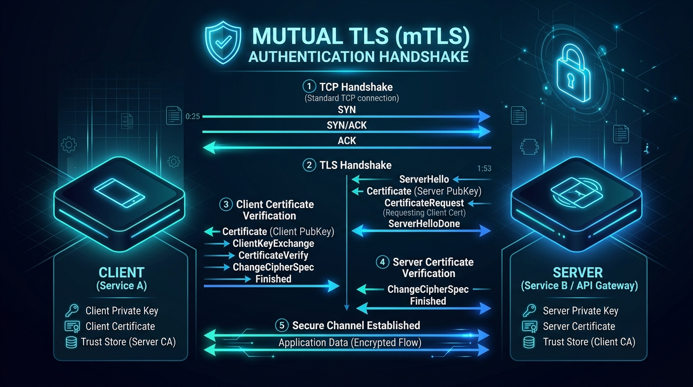

# 🛡️ Chapter 14 — Custom SSL Certificates & Mutual TLS (mTLS)

In enterprise, intranet, or air-gapped environments without public internet access, Let's Encrypt cannot validate domains. In this chapter, we configure **Custom Commercial / Internal Wildcard Certificates** and **Mutual TLS (mTLS)** client certificate authentication.


---

## 👶 Beginner's Explanation (ELI5)
> *Instead of asking Let's Encrypt for public ID badges, you print your own **highly classified government badges (Client Certificates)**. If a visitor doesn't physically possess one of your custom badges, the receptionist won't even talk to them!*

## 💡 Why do we need this?
> For maximum security in corporate intranets, or when dealing with highly sensitive admin panels where even a password prompt is too risky to expose.

---

## 🖼️ Architecture Diagram


> **Diagram Explanation:** A high-level technical visualization of the concepts discussed in this chapter.

---

---

## 🏗️ Mutual TLS (mTLS) Handshake Flow

```
[ Client Device ]                                            [ Traefik Proxy ]
       │                                                             │
       │ ── 1. ClientHello ────────────────────────────────────────▶ │
       │ ◀─ 2. ServerHello + Server Certificate (server.crt) ─────── │
       │ ◀─ 3. Certificate Request (Requires Client Certificate) ─── │
       │                                                             │
       │ ── 4. Client Certificate (client.crt) ────────────────────▶ │
       │                                                             │  (Validates client.crt
       │                                                             │   against client-ca.crt)
       │                                                             │
       │ ◀─ 5. Handshake Complete (Encrypted Session Established) ─▶ │
```

---

## ⚙️ Configuration Setup

### 1. File Provider Certificate Store (`dynamic-tls-certificates.yml`)
```yaml
tls:
  certificates:
    - certFile: /certs/server.crt
      keyFile: /certs/server.key
      stores:
        - default

  options:
    # mTLS profile: Clients MUST present a valid cert signed by client-ca.crt
    require-client-cert:
      minVersion: VersionTLS13
      clientAuth:
        caFiles:
          - /certs/client-ca.crt
        clientAuthType: RequireAndVerifyClientCert
```

### 2. Enforcing mTLS on Specific Application Routers
```yaml
labels:
  - "traefik.enable=true"
  - "traefik.http.routers.admin-vault.entrypoints=websecure"
  - "traefik.http.routers.admin-vault.rule=Host(`vault.$MY_DOMAIN`)"
  - "traefik.http.routers.admin-vault.tls.options=require-client-cert@file"
```

---

## 🚀 Demo Time: Step-by-Step Practical

**1. Start the Stack**
```bash
docker compose -f mtls-docker-compose.yml up -d
```

**2. Test the mTLS Rejection**
Try to visit your application in a normal web browser. 
**Output Expectation:** You will receive an immediate SSL connection error (`ERR_BAD_SSL_CLIENT_AUTH_CERT`). Traefik drops the connection at the TLS handshake level because your browser didn't present the highly classified client certificate!

**3. Teardown**
```bash
docker compose -f mtls-docker-compose.yml down
```

---

## 📁 Included Offline Example Stacks

- 📄 [`traefik.yml`](./traefik.yml) — Static config with certificates directory
- 📄 [`dynamic-tls-certificates.yml`](./dynamic-tls-certificates.yml) — TLS store & mTLS definitions
- 🐳 [`traefik-docker-compose.yml`](./traefik-docker-compose.yml) — Compose with certs volume mount
- 📜 [`generate-certs.sh`](./generate-certs.sh) — OpenSSL script generating CA, Server & Client certs
- 🔒 [`.env.example`](./.env.example)

---

[⬅️ Chapter 13 — SSO & ForwardAuth](../13-sso-forwardauth-authelia/README.md) | [🏠 Master Index](../../README.md) | [➡️ Next: Chapter 15 — Plugins & Security](../15-plugins-and-crowdsec/README.md)
