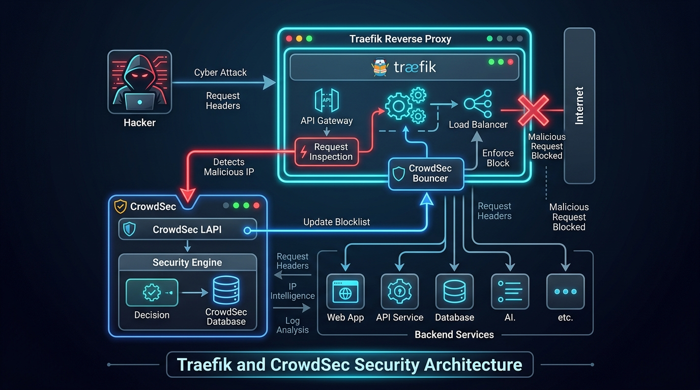

# 🛑 Chapter 15 — Plugins & Advanced Security with CrowdSec

Traefik features an extensible plugin ecosystem allowing you to load middleware plugins to provide **CrowdSec Intrusion Prevention**, **GeoIP Blocking**, and **Custom Header Manipulation**.


---

## 👶 Beginner's Explanation (ELI5)
> *Hiring a **global security intelligence agency (CrowdSec)**. If someone tries to pick a lock in Paris, CrowdSec instantly shares their picture globally, and your Traefik receptionist in New York will automatically block them from entering your building.*

## 💡 Why do we need this?
> Active threat blocking. It stops thousands of bots, brute-forcers, and malicious hackers from even touching your applications.

---

## 🖼️ Architecture Diagram


> **Diagram Explanation:** A high-level technical visualization of the concepts discussed in this chapter.

---

---

## 🏗️ CrowdSec Intrusion Prevention Flow

```
[ Inbound Request ]
        │
        ▼
 ┌─────────────┐
 │   Traefik   │ ──── 1. Intercept with CrowdSec Bouncer Plugin
 └──────┬──────┘
        │
        ├── 2. Query Local Decision API (LAPI) ──▶ ┌──────────────┐
        │                                          │   CrowdSec   │ (Global Threat Intel)
        │ ◀── 3. Decision: Allow or Ban (403) ──── └──────────────┘
        │
    (If Allowed)
        │
        ▼
 ┌─────────────┐
 │ Backend App │
 └─────────────┘
```

---

## ⚙️ Configuration Setup

### Step 1 — Declare Plugin in Static Config (`traefik.yml`)
```yaml
experimental:
  plugins:
    crowdsec:
      moduleName: "github.com/maxlerebourg/crowdsec-bouncer-traefik-plugin"
      version: "v1.3.3"
```

### Step 2 — Configure Dynamic Middleware (`dynamic-crowdsec.yml`)
```yaml
http:
  middlewares:
    crowdsec-bouncer:
      plugin:
        crowdsec:
          enabled: true
          crowdsecMode: live
          crowdsecLapiKey: "YOUR_CROWDSEC_LAPI_KEY"
          crowdsecLapiHost: "crowdsec:8080"
          crowdsecLapiScheme: "http"
```

### Step 3 — Protect Routers
```yaml
labels:
  - "traefik.http.routers.my-app.middlewares=crowdsec-bouncer@file"
```

---

## 🚀 Demo Time: Step-by-Step Practical

**1. Start the Stack**
```bash
docker compose -f crowdsec-docker-compose.yml up -d
```

**2. Test the Security Bouncer**
Simulate a malicious attack (e.g., trying to exploit a known vulnerability or running a dirbusting scan against your server).
CrowdSec will parse the Traefik logs, identify the malicious behavior, and instruct the Traefik bouncer plugin to instantly drop all further connections from your IP with a `403 Forbidden`!

**3. Teardown**
```bash
docker compose -f crowdsec-docker-compose.yml down
```

---

## 📁 Included Offline Example Stacks

- 📄 [`traefik.yml`](./traefik.yml) — Static config with plugin declaration
- 📄 [`dynamic-crowdsec.yml`](./dynamic-crowdsec.yml) — Dynamic middleware configuration
- 🐳 [`traefik-docker-compose.yml`](./traefik-docker-compose.yml) — Traefik + CrowdSec container stack
- 🔒 [`.env.example`](./.env.example)

---

[⬅️ Chapter 14 — Custom SSL & mTLS](../14-custom-ssl-and-mtls/README.md) | [🏠 Master Index](../../README.md)
