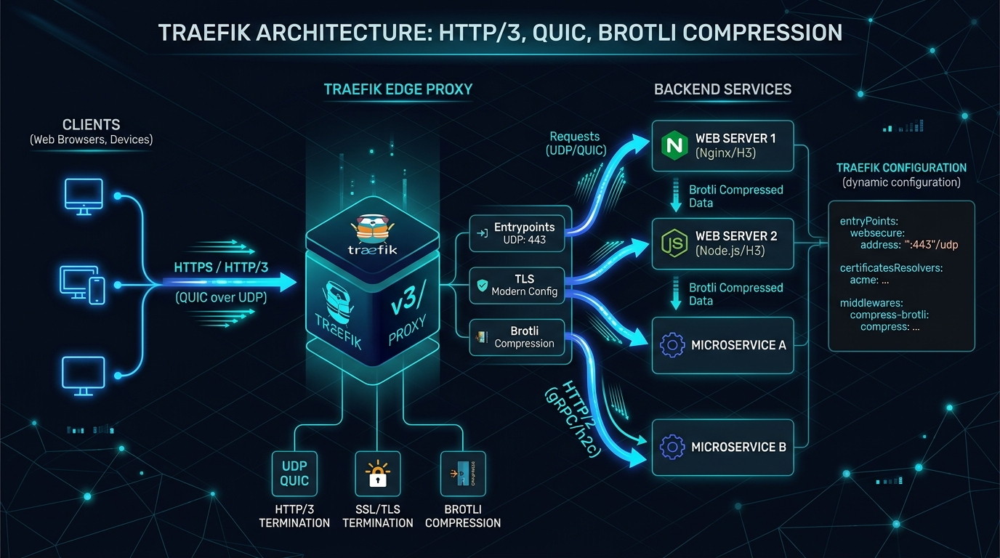

# 🚀 Chapter 16 — HTTP/3 (QUIC) & Brotli Compression

Traefik v3 brings native, production-ready support for **HTTP/3 over QUIC** and **Brotli compression**, providing massive latency reductions and better bandwidth utilization, especially for mobile clients.


---

## 👶 Beginner's Explanation (ELI5)
> *Upgrading the building's hallways with **high-speed moving walkways (HTTP/3)** and super-compressing all the mail so it takes up less space (Brotli).*

## 💡 Why do we need this?
> To make your websites load blazingly fast, reducing latency especially for users on spotty mobile data networks.

---

## 🖼️ Architecture Diagram


> **Diagram Explanation:** A high-level technical visualization of the concepts discussed in this chapter.

---

---

## 🏗️ HTTP/3 & QUIC Architectural Flow

```
[ Client / Browser ]
        │
        ├── 1. Initial Request (HTTP/1.1 or HTTP/2 over TCP) 
        │
┌───────▼───────┐
│    Traefik    │ ──── 2. Response with Header: `Alt-Svc: h3=":443"; ma=2592000`
└───────┬───────┘
        │
        ├── 3. Client switches to UDP ──────────────────────────┐
        │                                                       │
[ Client / Browser ] ◀── 4. Future Requests (HTTP/3 over UDP) ──┘
```

---

## ⚙️ Configuration Setup

### Step 1 — Enable HTTP/3 & Experimental Features (`traefik.yml`)
To support HTTP/3, the entrypoint must be enabled for HTTP/3, and UDP port 443 must be opened.

```yaml
experimental:
  v3: true           # If running Traefik v2.10+. In Traefik v3.0+, this is default.
  
entryPoints:
  websecure:
    address: ":443"
    http3:
      advertisedPort: 443
```

### Step 2 — Enable Brotli Compression (Dynamic Config)
Brotli natively compresses text/html/json better than GZIP.

```yaml
http:
  middlewares:
    compress-brotli:
      compress:
        defaultEncoding: br
```

---

## 🚀 Demo Time: Step-by-Step Practical

**1. Start the Stack**
```bash
docker compose -f traefik-docker-compose.yml up -d
```

**2. Test HTTP/3 (QUIC)**
Open Chrome/Firefox Developer Tools (F12) -> Network tab. 
Visit your HTTPS domain. Check the `Protocol` column. 
**Output Expectation:** It should say `h3` (HTTP/3) instead of `h2` or `http/1.1`. You are now successfully serving traffic over UDP!

**3. Teardown**
```bash
docker compose -f traefik-docker-compose.yml down
```

---

## 📁 Included Offline Example Stacks

- 📄 [`traefik.yml`](./traefik.yml) — Static config enabling HTTP/3 and QUIC
- 📄 [`dynamic-compress.yml`](./dynamic-compress.yml) — Dynamic middleware for Brotli compression
- 🐳 [`traefik-docker-compose.yml`](./traefik-docker-compose.yml) — Traefik container exposing 443/UDP
- 🔒 [`.env.example`](./.env.example)

---

[⬅️ Chapter 15 — Plugins & Security](../15-plugins-and-crowdsec/README.md) | [🏠 Master Index](../../README.md) | [➡️ Next: Chapter 17 — Canary & Mirroring](../17-canary-and-mirroring/README.md)
