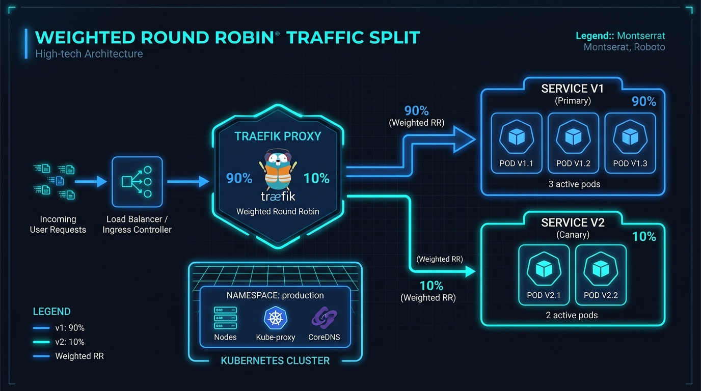

# ⚖️ Chapter 17 — Canary Deployments & Traffic Mirroring

Zero-downtime deployments often require **Canary releases** (sending 10% of traffic to a new version) or **Traffic Mirroring** (shadowing 100% of live traffic to a testing server without the user knowing).


---

## 👶 Beginner's Explanation (ELI5)
> *You build a brand new room, but you're not sure if it's safe. Instead of sending everyone there, you send 90% of people to the old room, and 10% to the new one (**Canary**). Or, you magically clone every visitor and send the invisible ghosts to the new room to see if it breaks (**Mirroring**)!*

## 💡 Why do we need this?
> To test massive app updates in production without risking downtime for all your users.

---

## 🖼️ Architecture Diagram


> **Diagram Explanation:** A high-level technical visualization of the concepts discussed in this chapter.

---

---

## 🏗️ Traffic Mirroring Flow

```
[ Inbound Request ]
        │
┌───────▼───────┐
│    Traefik    │ ──── 100% of Traffic ────▶ [ V1 App (Live) ]
└───────┬───────┘
        │
        └── (Background Mirror) ───────────▶ [ V2 App (Testing/Shadow) ]
               (Ignores V2 Response)
```

---

## ⚙️ Configuration Setup

### 1. Canary Deployments (Weighted Round Robin)
Send 80% of requests to `app-v1` and 20% to `app-v2`.

```yaml
# dynamic-canary.yml
http:
  services:
    app-canary:
      weighted:
        services:
          - name: app-v1@docker
            weight: 80
          - name: app-v2@docker
            weight: 20
```

### 2. Traffic Mirroring (Shadowing)
Send real traffic to `app-v1`, but mirror a copy of all requests to `app-v2` for testing without affecting the user response.

```yaml
# dynamic-mirror.yml
http:
  services:
    app-mirror:
      mirroring:
        service: app-v1@docker    # The main backend returning the response
        mirrors:
          - name: app-v2@docker   # The shadow backend receiving a copy
            percent: 100          # Mirror 100% of traffic
```

---

## 🚀 Demo Time: Step-by-Step Practical

**1. Start the Stack**
```bash
docker compose -f canary-docker-compose.yml up -d
```

**2. Test Canary Traffic Splitting**
Spam a curl request to your application endpoint:
```bash
for i in {1..10}; do curl -s -H Host:app.example.com http://127.0.0.1; done
```
**Output Expectation:** If your weights are 90/10, you should see 9 responses from `app-v1` and exactly 1 response from `app-v2`. The traffic is mathematically split!

**3. Teardown**
```bash
docker compose -f canary-docker-compose.yml down
```

---

## 📁 Included Offline Example Stacks

- 📄 [`dynamic-canary.yml`](./dynamic-canary.yml) — Canary weighted routing config
- 📄 [`dynamic-mirror.yml`](./dynamic-mirror.yml) — Traffic mirroring config
- 🐳 [`canary-docker-compose.yml`](./canary-docker-compose.yml) — Stack with App V1 and App V2 containers
- 🔒 [`.env.example`](./.env.example)

---

[⬅️ Chapter 16 — HTTP/3 & Brotli](../16-http3-quic-and-brotli/README.md) | [🏠 Master Index](../../README.md) | [➡️ Next: Chapter 18 — Tailscale](../18-tailscale-integration/README.md)
